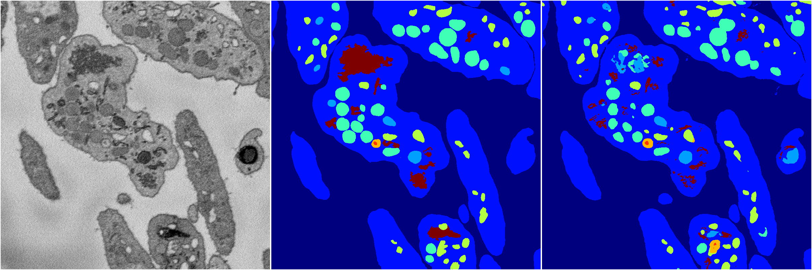

# Cell stuff

The _Patient 1_ platelet dataset looks like

<video src="overview.mp4" width="500" height="500" controls preload></video>

Up until recently, we sought to segment portions of this data into 7 classes - background, cytoplasm/membrane, canalicular system, alpha granules, dense granules, and dense granule cores. In the past couple weeks, we've worked with Kenny and Nash to add another class - we're calling it "endoplasmic reticulum".

Over the weekend, we started running network training experiments on the new data. I set 100 randomly-generated 2D u-net architectures to train for 30 epochs. In one sense, the networks had a hard time detecting what we'd labeled as "ER", when evaluated on validation data. In particular, it fails to properly classify the large ER mass in the center cell.

However, I have a question about this. Are we trying to put multiple distinct structures into this ER class? That big ER mass shares local characteristics with other ER areas - similar intensity, and lack of visible membrane at its boundary.

<video src="ermass.mp4" width="285" height="180" controls preload></video>

However, that cell is the only place in the Patient 1 data where "ER" congregates in such a large mass. Everywhere else in the eval and training data, ER seems to form a network of narrow tubes connecting other organelles.

<video src="ertubes.mp4" width="180" height="230" controls preload></video>

In some areas, ER has the appearance of congreg
