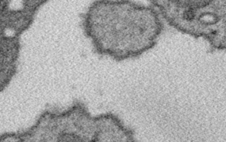

# Segmentation with "ER"

Overview of the results from 100 random 2D u-nets training on the new 8-class segmentation labels.

---

## Data

Up until recently, we sought to segment portions of this data into 7 classes - background, cytoplasm/membrane, canalicular system, alpha granules, dense granules, and dense granule cores. In the past couple weeks, we've worked with Kenny and Nash to add another class - we're calling it "endoplasmic reticulum".

Over the weekend, we started running network training experiments on the new data. I set 100 randomly-generated 2D u-net architectures to train for 30 epochs. In one sense, the networks had a hard time detecting what we'd labeled as "ER", when evaluated on validation data. In particular, it fails to properly classify the large ER mass in the center cell.

---

## ER Mass Interpetation

I have a question about the large ER mass. As it stands, are we including multiple different structures under the ER label? The mass shares local characteristics with other ER areas - similar intensity, and lack of visible membrane at its boundary.

However, that cell is the only place in the Patient 1 data where "ER" congregates in such a large mass. Everywhere else in the eval and training data, ER seems to form a network of narrow tubes connecting other organelles.

In some areas, ER looks like that when it surrounds similarly-colored mitochondria. 

However, it is difficult to say whether any distinct structure is contained within the area shown in Animation 1.

